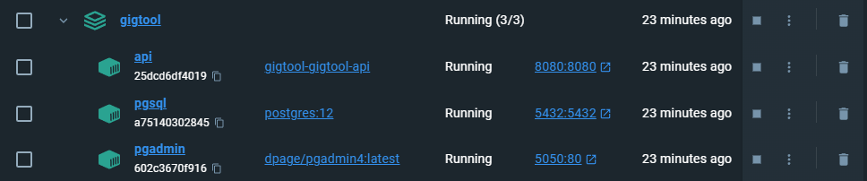

- [GigTool Dokumentation](#gigtool-dokumentation)
    - [Installationsanleitung](#installationsanleitung)
    - [Architektur](#architektur)
        - [Komponenten](#komponenten)
            - [api](#api)
            - [storage](#storage)
            - [db](#db)
            - [docker](#docker)
            - [maven](#maven)
        - [Interfaces (wird noch überarbeitet)](#interfaces-wird-noch-überarbeitet)
        - [Größere Architekturänderungen im Vergleich zu Java 1](#größere-architekturänderungen-im-vergleich-zu-java-1)
        - [Calc](#calc)
        - [WeightClass und WeightClassList](#weightclass-und-weightclasslist)
        - [EquipmentList](#equipmentlist)
        - [Happening](#happening)
        - [Rental und Gig](#rental-und-gig)
        - [Dimension](#dimension)
    - [Anwenderdokumentation](#anwenderdokumentation)
        - [Intellj](#intellj)
        - [Postman](#postman)
        - [Auflistung Endpoints](#auflistung-endpoints)
    - [Besonderheiten/Features des Projekts](#besonderheitenfeatures-des-projekts)
    - [Lessons Learned](#lessons-learned)
    - [Über den Projektumfang hinausgehende Funktionen](#über-den-projektumfang-hinausgehende-funktionen)

# GigTool Dokumentation

Willkommen bei der Dokumentation unserer API-Applikation GigTool.

Ein Herzensprojekt von Robin Harris, Hendrik Lendeckel, Dario Daßler und Max Schelenz für die Inventarisierung und Organisation von Musikequipment.

Wir möchten Musikern dabei helfen ihr Equipment zu verwalten, um sich auf das eigentlich Wichtige - die Musik fokussieren zu können.

<pre> Hinweis: Unser Projekt wurde wie besprochen als Verbesserungsversuch für Java 1 angemeldet. </pre>

Zum Einstieg möchten wir euch erstmal zeigen, wie ihr unsere API-Applikation installieren könnt.

--- 

## Installationsanleitung

[Docker Desktop](https://www.docker.com/products/docker-desktop/) benötigen wir für die Docker Engine.

Die [Intellj IDE](https://www.jetbrains.com/de-de/idea/download/?section=windows) nutzen wir im späteren Verlauf für die Tests der Services.

Die [Postman-App](https://www.postman.com/downloads/) werden wir später in der Anwenderdokumentation nutzen, um unsere Routen und Controller zu testen.

<pre>git clone https://git.ai.fh-erfurt.de/prgj2-23/gigtool.git
docker compose up</pre>

## Architektur

Die GigTool Architektur umfasst mehrere strukturelle Bereiche, die wir euch in den kommenden Abschnitten verständlich näher bringen wollen.

### Klassendiagramm

### Komponenten

#### api
Wie im Komponentendiagramm zu erkennen, enthält die api alle wichtigen Controller-Klassen.
Diese sind für das Routing der Anfragen zu den Endpoints zuständig.

#### storage
Die storage Komponente ist unterteilt in verschiedene Module.

Das "model" ist für die Definition der Datenbank-Objekte vorgesehen und beschreibt deren Aussehen.

Die repos im "repositories"-Modul, benötigen wir um überhaupt Datenbank-Operationen anwenden zu können. 
Sie sind bei Bedarf beliebig erweiterbar, falls die JPA-Funktionalitäten nicht ausreichen.

Das services-Modul ist nochmal unterteilt in service.models und services.
Die service.models definieren die Struktur der create- und response-Objekte.
Services sind für die Trennung von Geschäftslogik und Datenbankzugriff zuständig.

#### db
Die Komponente "db" enthält unser Initialiserungsskript mit dem Namen der Datenbank und dem root-User zur Verwaltung.

#### docker
Die docker-compose.yml ist unsere docker-Komponente im Projekt. Sie sorgt für die Containerisierung unserer ApiApplication, PostgreSQL-DB und dem Verwaltungstool pgadmin.

#### maven
Die Maven POM enthält alle wichtigen Abhängigkeiten für unser Spring Boot-Projekt und stellt sozusagen den Build-Planer dar.

### Interfaces (muss noch überarbeitet werden wenn sich Docker ändert muss der Docker frame um alle 3 gehen nicht nur um DB)

Im folgenden Schaubild zeigen wir euch, wie unser API-Interface funktioniert und welche Abläufe im backend angestoßen werden, wenn der User beispielsweise ein Equipment anlegen möchte.

### Größere Architekturänderungen im Vergleich zu Java 1

Unser Projekt haben wir von Java 1 weitergeführt. Der Grad an Komplexität ist jedoch deutlich gestiegen und wir haben mehrere Umbauten vornehmen müssen.

### Calc

Diese Utility-Class wurde entfernt, da wir festgestellt haben, dass alle Funktionen auf entsprechende Services aufgeteilt werden konnten.

### WeightClass und WeightClassList

Diese Klassen waren gedacht um das Equipment, anhand des Gewichts zu Kategorisieren.
Diese Kategorien (WeightClasses) waren aufsteigend in der WeightClassList gespeichert.
Das sollte dazu dienen, Aussagen über das Gewicht/Gesamtgewicht geben zu können.
Um die Klassenstruktur zu vereinfachen wurden diese Klassen gestrichen.
Aussagen über das Gewicht/Gesamtgewicht können trotzdem getroffen werden, da das Eigengewicht in der
Entität Equipment gespeichert wird.

### EquipmentList

Diese Hilfsklasse wurde entfernt und durch das direkte Verknüpfen von Equipments in Happenings und Band realisiert.

### Happening

Diese Klasse ist nun nicht mehr Abstract, da wir eine PostgresSQL-Datenbank nutzen.

### Rental und Gig

Diese Klassen erben nun nicht mehr von Happening. Sie verweisen jedoch auf ihr Happening.

### Dimension

Diese Klasse wurde entfernt, weil der Sinn und Zweck erhalten bleibt, wenn wir Länge, Breite, Höhe direkt in der Entität
Equipment speichern.

## Anwenderdokumentation

Wenn alle in der Installtionsanleitung beschriebenen Schritte erfolgreich ausgeführt wurden, sollte die ApiApplication, PostgreSQL-Datenbank und pgadmin auf der Docker Engine laufen.

- ToDo Bild noch überarbeiten wenn alles dockerized ist mit Jar und Co kommt noch ein container dazu

### Intellj

Für den Test der Services und Repositories ermöglicht uns die Intellj-IDE die Ausführung unserer Applikation.
Über das RUN-menü im oberen Bereich unserer IDE können wir dann die Applikation starten, nachdem wir alle Maven Dependencies erfolgreich installiert haben.

Im Anschluss sobald die Applikation läuft, können wir in der storage-Komponente unsere Testklassen starten.
Mittels Rechtsklick auf den java-Testordner gelangen wir in das Optionsmenü, in dem wir " Run 'All Tests' " ausführen können.

Nun sollten alle vorhandenen Tests durchgeführt werden und im Konsolenfenster der IDE bekommen wir eine Auskunft über alle erfolgreichen oder auch fehlgeschlagenen Tests.

Zum Beispiel:

### Postman

Postman ist eines der beliebtesten Werkzeuge zum Testen von APIs (Application Programming Interfaces).

#### Auflistung Endpoints

#### Import der Collection

Die GigTool Postman Collection findet ihr im Java 2 GigTool/gigtool/dokumentation/postman_collection Ordner.

Diese könnt ihr ganz simpel per Drag&Drop in Postman importieren.

#### Ausführung der Collection

Mittels Rechtsklick auf den Collection_Ordner könnt ihr die komplette Collection ausführen. 

Der GigTool API Run durchläuft dann alle gespeicherten Methoden...

und überprüft deren Ergebnisse auf Erfolg oder Fehlschlag.

Im Postman Documentation Bereich haben wir für jeden Endpoint Beschreibungen und Beispiele hinzugefügt, um einen möglichst detaillierten Einblick zu gewährleisten.

## Besonderheiten/Features des Projekts

Im Laufe des Projekts haben sich ein paar coole Features angesammelt, die es in unseren Augen verdienen hier nochmal erwähnt zu werden.

### TestUtils

Als Random-Generator für unsere Servicetests nutzen wir unsere test_utils Klasse.
Das erspart uns beim Erstellen der vielen Testszenarien des Öfteren wertvolle Zeit.

### Kollisionsprüfungen

GigTool verhindert durch verschiedene Überprüfungen Kollisionen bei der Verwaltung des Equipments.
Folgende Kollisionsprüfungen werden von unserer Application abgedeckt:

- mehrere Gigs des Musikers können nicht gleichzeitig stattfinden
- Equipment ist nicht doppelt während eines Zeitslots verbuchbar (Verleihung während eines Gigs, welcher das Equipment benötigt, ist nicht möglich)
- Instrument, welches einer Band zugeordnet ist, darf automatisch nicht während des Auftritts dieser Band verliehen werden
- bei Änderungen des Zeitraums eines Happenings, wird der neue Zeitpunkt erneut auf Kollisionen überprüft

### Timetable

//ToDo

## Lessons Learned

> - Aufbau einer API-Applikation in Java
> - Spring Boot
> - Maven POM
> - JPA repos
> - dockerize/manage PostgreSQL
> - Postman Collection + Workspaces
> - Location, Address und TypeOfLocation sind sehr komplex verschachtelt => hier hatten wir große Ambitionen sind dann aber an einen zu hohen Grad an Komplexität gelangt
> - bei Happening ist uns der Schritt der Vereinfachung gelungen => hier konnten wir ein einheitliches Zeitformat (Zeit + Datum) für alle Happenings einführen und unsere Datenstrukturen optimieren

## Über den Projektumfang hinausgehende Funktionen

Responses könnten mit einer response_utils noch weiter verfeinert werden. Beispielsweise zu individuellen Messages bei nicht 2xx-Statuscodes.

Bei dem Hinzufügen von mehreren Equipments zu einer Band könnte man anstelle von mehreren Aufrufen mit path-Paramtern auch eine Liste der hinzuzufügenden Equipments im Body übergeben. Dadurch könnten wir den Traffic noch mehr optimieren und die Usability verbessern.

Unsere Applikation könnte durch weitere Get-Requests oder Suchfunktionen nochmals funktionell erweitert werden, z.B. getAllBandsWithGenre oder searchByDescription.
