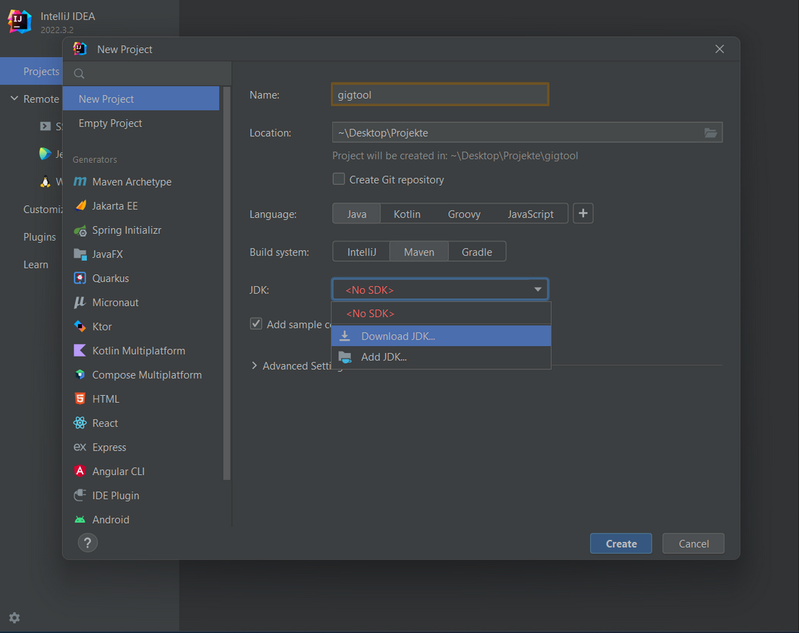
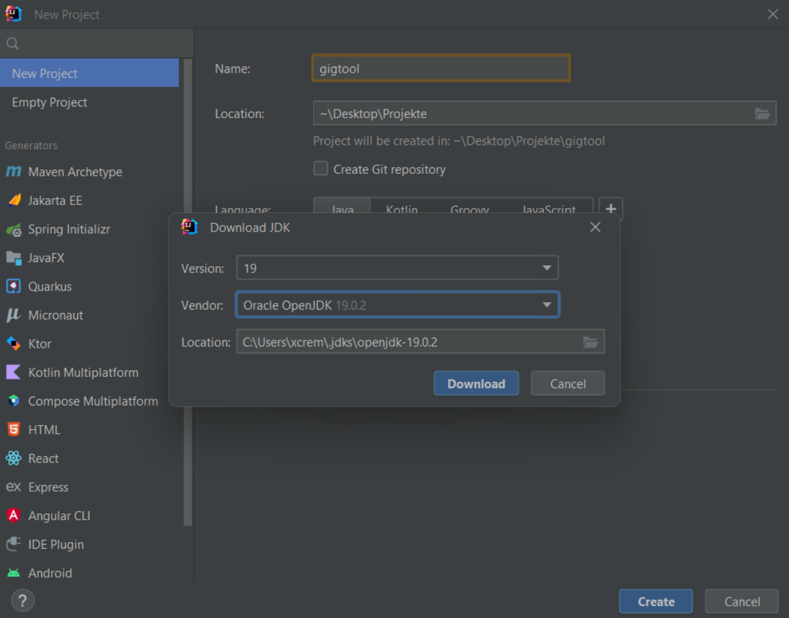
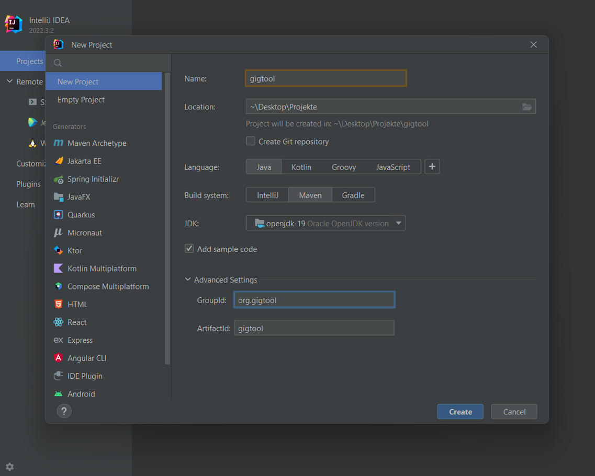
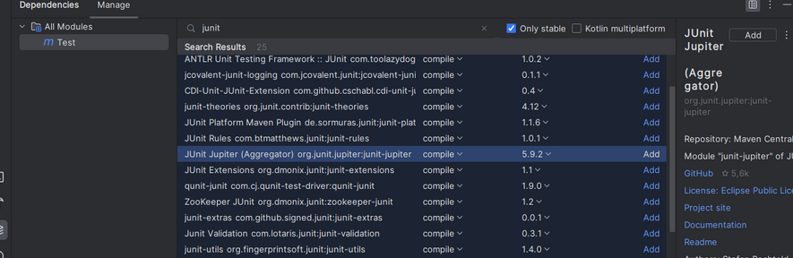

# **Gigtool - Java 1 Projektarbeit**


  - [**Teamvorstellung**](#entwicklerteam)- [**Gigtool - Java 1 Projektarbeit**](#gigtool-java-1-projektarbeit)
  - [**Entwicklerteam**](#entwicklerteam)
  - [**Gigtool**](#gigtool)
    - [**a) Inventarisierung**](#a-inventarisierung)
    - [**b) Anlegen eines Auftritts**](#b-anlegen-eines-auftritts)
    - [**c) Anlegen einer Leihgabe**](#c-anlegen-einer-leihgabe)
    - [**d) Anlegen einer Band**](#d-anlegen-einer-band)
    - [**e) Berechnungen**](#e-berechnungen)
      - [**Gewicht**](#gewicht)
      - [**Kosten**](#kosten)
  - [**Funktionalitäten**](#funktionalitäten)
      - [**Mögliche zukünftige Funktionalitäten**](#mögliche-zukünftige-funktionalitäten)
  - [**Architektur**](#architektur)
    - [**Design-Entscheidungen**](#design-entscheidungen)
      - [**a) Inventory - Singleton**](#a-inventory-singleton)
      - [**b) Happening - abstract**](#b-happening-abstract)
      - [**c) Zusätzliche Klasse EquipmentList**](#c-zusätzliche-klasse-equipmentlist)
      - [**d) Berechnungen in Calc**](#d-berechnungen-in-calc)
      - [**e) Kalenderfunktion**](#e-kalenderfunktion)
      - [**f) WeightClassList**](#f-weightclasslist)
    - [**Klassendiagramm**](#klassendiagramm)
  - [**Installation**](#installation)
    - [**für Windows**](#für-windows)
      - [**Schritt 1:**](#schritt-1)
      - [**Schritt 2:**](#schritt-2)
      - [**Schritt 3:**](#schritt-3)
      - [**Schritt 4:**](#schritt-4)
    - [**für Ubuntu 20.04 LTS**](#für-ubuntu-2004-lts)
      - [**Schritt 1:**](#schritt-1-1)
      - [**Schritt 2:**](#schritt-2-1)
      - [**Schritt 3:**](#schritt-3-1)
      - [**Schritt 4:**](#schritt-4-1)
      - [**Schritt 5:**](#schritt-5)
  - [**Gigtool-Mindmap**](#gigtool-mindmap)


## **Entwicklerteam**

Wir sind die Pojektgruppe BeOne bestehend aus Hendrik Lendeckel, Robin Harris, Max Schelenz und Dario Daßler.
Für unsere Projektarbeit im Fach Java 1 haben wir uns für das Programm "GigTool" entschieden.

## **Gigtool**

GigTool ist eine Verwaltungssoftware für Musiker. Dieser soll die Möglichkeit haben sein
Equipment zu Inventarisieren und zu organisieren. Es soll zu jeder Zeit bekannt sein, an
welchem Ort sich das Equipment befindet. Des Weiteren sollen Auftritte geplant werden
können und das Equipment diesen zugewiesen werden. Die Software ist als Einzelanwender-
Programm gedacht. Folgende Funktionalitäten sollen abgedeckt werden:

### **a) Inventarisierung**

Das Programm behandelt den Musiker als zentrale Person, welche das Programm allein
bedient. Jedes Equipment welches angelegt wird, ist Bestandteil des Inventars.

### **b) Anlegen eines Auftritts**

Der Musiker kann Auftritte anlegen und somit seinen Bedarf an Equipment planen. Hierfür
legt er den Auftritt mit all seinen Details und einer Liste an Equipment an. Alle Auftritte
werden in einem Kalender gespeichert.

### **c) Anlegen einer Leihgabe**

Eine Leihgabe-Funktion ist enthalten, um den Fall abzudecken, dass das Equipment für
diesen Moment nicht zur Verfügung steht. Auch die Leihgaben sind im Kalender präsent.

### **d) Anlegen einer Band**

Eine Band stellt eine Art Preset da, welches der Musiker im Vorhinein definiert.
Beispielsweise kann er in mehreren Bands spielen und auch in diesen Bands mehrere Rollen
(Gesang/Gitarre/etc.) übernehmen. Somit benötigt er auch pro Band unterschiedliches
Equipment. Einem Auftritt kann nun das Equipment hinzugefügt werden oder direkt eine
Band.

### **e) Berechnungen**

#### **Gewicht**

Jedes Equipment hat ein Gewicht und wird automatisch in vordefinierte Gewichtsklassen
eingeordnet. Diese Gewichtsklassen legt der Benutzer selbst fest. Das Gesamtgewicht wird
automatisch berechnet. Somit kann der Musiker eine Einschätzung über die
Transportfähigkeit erhalten.

#### **Kosten**

Zu jedem Equipment wird der Kaufpreis miterfasst. Somit ist eine Berechnung der gesamten
Investitionskosten pro Auftritt/Leihgabe/Band möglich.

## **Funktionalitäten**

- Erstellen von Equipment
- Erstellen von Gewichtsklassen
- Auflisten der Gewichtsklassen inkl. Automatischer Prüfung
- Anlegen einer Band und Erstellen von EquipmentLists
- Anlegen von Happenings (Gig oder Leihgabe)
- Automatische EInteilung des Equipments in Gewichtsklassen
- Aufrechnen der Kosten in einer EquipmentList
- Auflisten aller Locations in einer EquipmentList
- Sortieren dieser Locations nach LocationType-Name
- Berechnen des Gesamtgewichts einer EquipmentList


#### **Mögliche zukünftige Funktionalitäten**
- Buchen von Transportmitteln (PKW/LKW, ...)
- weiterführende Berechnungsmethoden (Dimensions, ...)

## **Architektur**

GigTool ist objektorientiert geschrieben und in Haupt und Nebenklassen aufgeteilt.
Die Hauptklassen sind Klassen, in denen die Hauptbestandteile untergebracht sind. Zu Ihnen
zählen:

- Inventory
- Happening
- Equipment
- Band
- EquipmentList
- Calc
- Timeslot
- Timetable
- Gig
- Rental

Alle anderen Klassen zählen zu den Nebenklassen. Ihre Aufgabe sind unterstützende
Funktionen/Definitionen und spätere Datenmodelle wie Address (weitere siehe
Klassendiagramm). Wir haben uns bei Definitionen gegen Enums entschieden, da wir das
Programm flexibel und erweiterbar halten wollten.


### **Design-Entscheidungen**

#### **a) Inventory - Singleton**

Das Inventory wird mithilfe eines Singleton Patterns bereitgestellt, da es nur ein Inventory
pro Musiker geben darf.

#### **b) Happening - abstract**

Da sich die Klassen Gig und Rental sehr ähneln, aber dennoch unterschiede aufzeigen, erben
sie beide von der gemeinsamen Elternklasse Happening. Es darf jedoch keine Instanz der
Klasse Happening geben, weshalb diese abstract ist. In der Klasse Happening befinden sich
gemeinsame Attribute wie Name, Beschreibung, Adresse, Zeit Slot und eine EquipmentList in
welcher das Equipment gespeichert wird. Zusätzlich zu diesen Informationen benötigt die
Klasse Gig noch weitere Attribute – siehe Klassendiagramm.

#### **c) Zusätzliche Klasse EquipmentList**

Hinter der Klasse EquipmentList verbirgt sich eine ArrayList<Equipment> und das totalWeigt
des aufgelisteten Equipments. Da diese Funktionalitäten in mehreren Klassen benötigt
werden (Inventory, Happening und Band) wurden diese separiert.

#### **d) Berechnungen in Calc**

Einige Berechnungen werden in mehreren Klassen verwenden und sin deshalb static
Funktionen in der separaten Klasse Calc.

#### **e) Kalenderfunktion**

Die Kalenderfunktionalität gestaltet sich wie folgt: Jedes Happening besitzt ein Timeslot
Attribut und wird dann in der Timetable gespeichert.

#### **f) WeightClassList**

Um eine nahtlose Abdeckung des Gewichts darzustellen, wurde eine Liste von
Gewichtsklassen angelegt. Das maximal-Gewicht beträgt 2000 KG. Gewichtsklassen sind
durch ein Startgewicht und eine Gewichtsspanne definiert. Überlappungen dieser
Gewichtsklassen werden behandelt, genauso wie ein Überschreiten des Maximalgewichtes.
Siehe Unit-Tests.


### **Klassendiagramm**
  


## **Installation**
### **für Windows**
### **Schritt 1**: 
**IntellJ IDEA Ultimate Installation via JetBrains Toolbox**

- Link: https://www.jetbrains.com/de-de/toolbox-app/ 

- Toolbox herunterladen und Installations-Assistenten durchlaufen
- mit eigenem Benutzerkonto anmelden und die IntellJ IDEA Ultimate über den Reiter "Tools" installieren
- Vorteil der Toolbox: IDE kann schnell und einfach verwaltet werden (Versionskontrolle + Aktualisierungsvorgang)

### **Schritt 2**:
**Git herunterladen und installieren**

- Link: https://gitforwindows.org/


### **Schritt 3**:

**Projekt einbinden**

Link: https://git.ai.fh-erfurt.de/prgj1-22/beone/gigtool


- um das Projekt zu klonen in GitLab auf der Startseite im Repository über den Clone-Button die HTTPS-URL kopieren
- git bash an gewünschtem Speicherort öffnen und folgendenden Befehl ausführen

      git clone https://git.ai.fh-erfurt.de/prgj1-22/beone/


- IntelliJ öffnen -> "_New Project_" 
- unter Download JDK -> "_Oracle JDK OpenJDK 19.0.2_" herunterladen




- alle wichtigen Projekteinstellungen vornehmen (auf exakten Projektnamen und GroupID achten)



### **Schritt 4**: 

**JUnit hinzufügen und Tests ausführen**
- in pom.xml -> "_Generate_" -> "_add dependency_" -> JUnit Jupiter (Aggregator 5.9.2) hinzufügen



  Der XML-Code sollte nun wie folgt aussehen:

```xml
<?xml version="1.0" encoding="UTF-8"?>
<project xmlns="http://maven.apache.org/POM/4.0.0"
         xmlns:xsi="http://www.w3.org/2001/XMLSchema-instance"
         xsi:schemaLocation="http://maven.apache.org/POM/4.0.0 http://maven.apache.org/xsd/maven-4.0.0.xsd">
    <modelVersion>4.0.0</modelVersion>

    <groupId>gigtool</groupId>
    <artifactId>gigtool</artifactId>
    <version>1.0-SNAPSHOT</version>

    <properties>
        <maven.compiler.source>19</maven.compiler.source>
        <maven.compiler.target>19</maven.compiler.target>
        <project.build.sourceEncoding>UTF-8</project.build.sourceEncoding>
    </properties>
    
    <dependencies>
        <dependency>
            <groupId>org.junit.jupiter</groupId>
            <artifactId>junit-jupiter</artifactId>
            <version>5.9.2</version>
        </dependency>
    </dependencies>

</project> 
```

- Rechtsklick auf "_pom.xml_" -> "_maven_" -> "_Reload project_"


Nun können die gewünschten Tests in der Intellj IDE ausgeführt werden, die Konfiguration ist hiermit für Windows 10/11 abgeschlossen.


### **für Ubuntu 20.04 LTS**

### **Schritt 1**:


**IntelliJ herunterladen und installieren**

- **Download** unter:

  https://www.jetbrains.com/idea/download/#section=linux

- **Entpacken** der tarball (Empfohlen: in das Verzeichnis **/Opt**)

      sudo tar -xzf ideaIU-*.tar.gz -C /opt

- **idea.sh** aus dem entpackten Verzeichnis ausführen


### **Schritt 2**:

**Git Installation**

Befehl zum Installieren der Pakete:

    sudo apt-get install git 


### **Schritt 3:**

**Projekt klonen**

Link: https://git.ai.fh-erfurt.de/prgj1-22/beone/gigtool

- Um das Projekt zu klonen in GitLab auf der Startseite im Repository über den Clone-Button die HTTPS-URL kopieren.

- In IntelliJ ein neues Projekt via "Project from Version Control" erstellen und die kopierte URL einfügen (optional den gewünschten Speicherort angeben)


### **Schritt 4**:

**JDK 19 hinzufügen:**

- Im Reiter "_File_" -> "_Project Structure_" JDK 19 herunterladen und hinzufügen

### **Schritt 5**:

**Unit Tests**

- Rechtsklick auf das Projekt -> "_Add Framework Support_" -> Maven auswählen
- In der neu erstellten pom.xml: 
    - Rechtsklick -> "_Generate_" -> "_Add dependency_" -> "JUnit Jupiter (Aggregator)" hinzufügen (in die Suchleiste eingeben).
    - Eine GroupID zuweisen indem man zwischen den "GroupID" tags "gigtool" eingibt 

  Der XML-Code sollte nun wie folgt aussehen:

```xml
<?xml version="1.0" encoding="UTF-8"?>
<project xmlns="http://maven.apache.org/POM/4.0.0"
         xmlns:xsi="http://www.w3.org/2001/XMLSchema-instance"
         xsi:schemaLocation="http://maven.apache.org/POM/4.0.0 http://maven.apache.org/xsd/maven-4.0.0.xsd">
    <modelVersion>4.0.0</modelVersion>

    <groupId>gigtool</groupId>
    <artifactId>gigtool</artifactId>
    <version>1.0-SNAPSHOT</version>

    <properties>
        <maven.compiler.source>19</maven.compiler.source>
        <maven.compiler.target>19</maven.compiler.target>
        <project.build.sourceEncoding>UTF-8</project.build.sourceEncoding>
    </properties>
    
    <dependencies>
        <dependency>
            <groupId>org.junit.jupiter</groupId>
            <artifactId>junit-jupiter</artifactId>
            <version>5.9.2</version>
        </dependency>
    </dependencies>

</project> 
```

- Rechtsklick auf die pom.xml -> "_Maven_" -> "_Reload project_"

Nun können die gewünschten Tests in der Intellj-IDE ausgeführt werden, die Konfiguration ist hiermit für Ubuntu 20.4 abgeschlossen.

